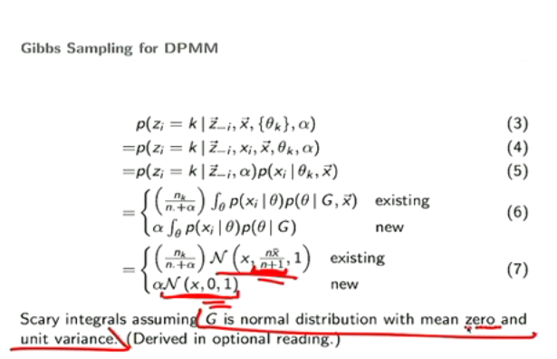

###

$$
\begin{aligned}
G \  is\ a \ distribution\\
X\sim G \\
G' \sim DP(G,\alpha)\\
E_{G'}(X') = E_{G}(X) \\
e.g.:\ G\sim N(0,1)
\end{aligned}
$$

### Gibbs sampling Updating

Shot from https://www.youtube.com/watch?v=UTW530-QVxo

Slides from http://www.umiacs.umd.edu/~jbg/teaching/CSCI_5622/17a.pdf

